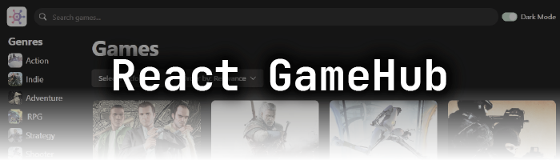

[](https://react-game-hub-gules.vercel.app/)

# GameHub – React Application

A responsive single-page application built with React and Vite. It uses the [RAWG.io API](https://rawg.io/apidocs) to display video game data and provides filtering, sorting, and search functionality.

**[Live Demo](https://react-game-hub-gules.vercel.app/)**

---

## Tech Stack

- **React** (with Hooks)
- **Vite** – Fast development/build tool
- **Chakra UI** – Component library and styling system
- **Axios** – HTTP client
- **RAWG.io API** – Game data provider

---

## Features

- Game search and full-text filtering
- Filtering by genre and platform
- Sort order by: Relevance, Date added, Name, Release Date, Popularity, Average Rating
- Dark/light mode toggle
- Responsive design
- Clean, modular component structure

---

## Getting Started

### Installation

```bash
git clone https://github.com/vanClausen/react_game-hub.git
cd react_game-hub
npm install
npm run dev
```

App will be available at `http://localhost:5173`

---

### Production Build

```bash
npm run build
npm run preview
```

---

## Environment Variables

Create a `.env` file in the root directory:

```env
VITE_RAWG_API_KEY=your_rawg_api_key
```

This key is injected at build time. You can obtain one from [RAWG.io](https://rawg.io/apidocs).

---

## Folder Structure

```
src/
├── assets/         # Static files and icons
├── components/     # Reusable UI components
├── data/           # Static data (genres)
├── hooks/          # Custom React hooks
└── services/       # API abstraction
```

---

